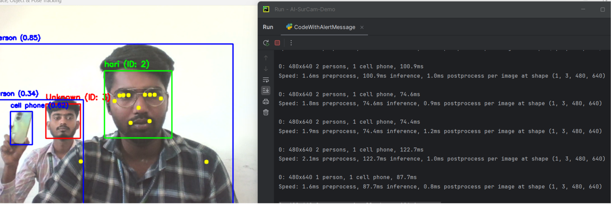
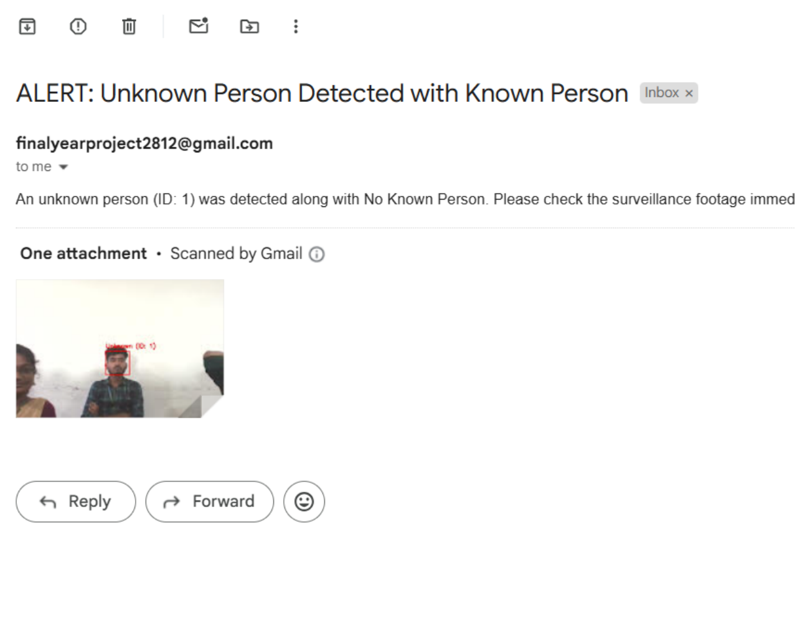

# AI-SurCam: Real-Time Anomaly Detection for Urban Areas


An intelligent surveillance system that combines face recognition, object detection, and pose estimation to provide real-time anomaly detection and automated email alerts for enhanced security in urban environments.

## 🌟 Features

- **Face Recognition System**: Identifies known and unknown persons in real-time using LBPH (Local Binary Patterns Histograms) face recognition
- **Object Detection**: Utilizes YOLOv8 for real-time object detection and tracking
- **Pose Estimation**: Implements MediaPipe for human pose detection and analysis
- **Automated Email Alerts**: Sends email notifications with captured images when unknown persons are detected
- **Person Tracking**: Assigns unique IDs to detected individuals and maintains tracking history

## 🚀 Installation

### Prerequisites

- Python 3.8 or higher
- Webcam or IP camera
- Internet connection (for email alerts)

> **Important:**  
> The `mediapipe` library only supports Python versions **3.7–3.11**.  
> If you use Python 3.12 or higher, `mediapipe` will not install.  
> Please ensure your Python version is **3.7, 3.8, 3.9, 3.10, or 3.11**.

### Setup

1. Clone the repository:
```bash
git clone https://github.com/muthumaran333/AI-SurCam-Real-Time-Anomaly-Detection-for-Urban-Areas.git
cd AI-SurCam-Real-Time-Anomaly-Detection-for-Urban-Areas

```

2. (Recommended) Create a virtual environment:
```bash
python -m venv venv
venv\Scripts\activate
```

3. Install required dependencies:
```bash
pip install -r requirements.txt
```

4. Download YOLOv8 model:
```bash
# The model will be automatically downloaded on first run
# Or manually download yolov8n.pt and place it in the project directory
```

## 📦 Dependencies

```
opencv-contrib-python>=4.5.0
numpy>=1.19.0
pandas>=1.2.0
torch>=1.9.0
mediapipe>=0.8.0
ultralytics>=8.0.0
reportlab>=3.6.0
```

## 📁 Project Structure

```
AI-SurCam-Real-Time-Anomaly-Detection-for-Urban-Areas/
├── images/                           # Output and report images
├── src/                              # Source code
│   ├── capture_image.py              # Captures face images for training dataset
│   ├── train_dataset.py              # Trains the face recognition model
│   ├── CodeWithAlertMessage.py       # Main surveillance system with alerts
│   ├── map.py                        # Generates PDF reports with heatmaps
│   ├── haarcascade_frontalface_default.xml
│
├── dataset_faces/                    # Directory for storing face images 
│   └── [person_name]/                # when you run capture_image.py it will create automatically
│
├── models/                           # Directory for trained models
│   ├── trained_face_model.yml        # if you run the train_dataset.py it will automatically created
│   └── labels.txt
│
├── yolov8n.pt                        # YOLOv8 model weights (automatically or mannually)
├── requirements.txt                  # Dependency list
└── README.md                         # Project documentation
```

> **Note:** Ensure the following folders and files are initialized before running the project:
>
> - Create the `dataset_faces/` directory for storing face images.
> - Create the `models/` directory for saving trained models.
> - Place `yolov8n.pt` (YOLOv8 weights) in the project root, or let it download automatically on first run.
> - If `trained_face_model.yml` and `labels.txt` do not exist in `models/`, they will be generated after training.
>
> You can initialize the folders using these commands:
>
> ```bash
> mkdir -p src/dataset_faces 
> mkdir -p src/models
> ```

## 💻 Usage

### Step 1: Capture Face Images

Run the image capture script to collect training data for known persons:

```bash
python src/capture_image.py
```

- Enter the person's name when prompted
- Face the camera and press 'q' to stop capturing
- Images will be saved in `dataset_faces/[person_name]/`

### Step 2: Train the Face Recognition Model

Train the model with captured face images:

```bash
python src/train_dataset.py
```

This will:
- Process all images in the `dataset_faces/` directory
- Train the LBPH face recognizer
- Save the trained model to `models/trained_face_model.yml`
- Generate a labels file mapping IDs to names

### Step 3: Run the Surveillance System

Start the main surveillance application:

```bash
python src/CodeWithAlertMessage.py
```

Features active in this mode:
- Real-time face recognition with name display
- Unknown person detection with ID assignment
- Object detection using YOLOv8
- Pose estimation overlay
- Automated email alerts after 30 seconds of unknown person presence
- Press 'q' to quit

## ⚙️ Configuration

### Email Alert Settings

Edit the email credentials in `CodeWithAlertMessage.py`:

```python
sender_email = "your_email@gmail.com"
receiver_email = "receiver_email@gmail.com"
password = "your_app_password"  # Use Gmail App Password
```

**Important**: For Gmail, enable 2-factor authentication and generate an App Password at [Google Account Settings](https://myaccount.google.com/apppasswords).

### Detection Thresholds

Adjust detection parameters in `CodeWithAlertMessage.py`:

```python
# Face recognition confidence threshold
confidence < 80  # Lower = stricter matching

# Unknown person alert timer (seconds)
elapsed_time > 30  # Time before sending alert

# Face detection parameters
scaleFactor=1.2
minNeighbors=5
```

## 🔧 How It Works

### Face Recognition Pipeline

1. **Image Capture**: Collects multiple face images for each person
2. **Face Detection**: Uses Haar Cascade classifier to detect faces in images
3. **Model Training**: Trains LBPH face recognizer with labeled face data
4. **Recognition**: Compares detected faces against trained model
5. **Classification**: Identifies persons as "Known" (with name) or "Unknown" (with ID)

### Alert System

1. Continuously monitors video feed for faces
2. Assigns unique IDs to unknown persons
3. Tracks presence duration of unknown individuals
4. Triggers email alert after 30 seconds of continuous unknown presence
5. Sends alert with captured frame and detection details
6. Prevents duplicate alerts for the same person

### Multi-Model Integration

- **Face Recognition**: OpenCV LBPH for facial identification
- **Object Detection**: YOLOv8 for detecting and classifying objects
- **Pose Estimation**: MediaPipe for human body keypoint detection

### Output






## 🎯 Use Cases

- Home security monitoring
- Office building surveillance
- Retail store loss prevention
- Smart city security systems
- Access control verification
- Event security management
